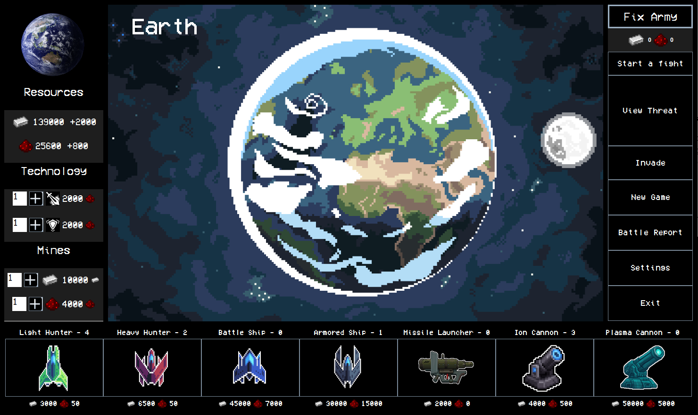

# Proyect PlanetWars AMS-AWS 24-25

## Team Members

- Rubén Bellido Navarro
- Aleix Linares Sousa
- Álvaro Armas Jurado


## Brief Introduction

*screenshot of our game's interface*

The objective of this project is to create a game that resembles the game **OGame**.

Playing the game our team has produced, you will be able to manage your own planet and fleet, which you have to use to defend yourself from enemy planets that want to invade you and take your resources.

Your fleet and defenses will be made of:
- Light Hunters
- Heavy Hunters
- Battle Ships
- Armored Ships
- Missile Launchers
- Ion Cannons
- Plasma Cannons

Their cost is set according to their stats. **Manage your resources wisely!**

The GUI is meant to be as interactive as possible, you can upgrade your technologies and resource mines, build new ships and defenses, invade other plantes, get invaded, check previous battles, modify your planet's name, and much more. All without needing to use a terminal.

### Programming
**This game is entirely made in [Java Swing](https://en.wikipedia.org/wiki/Swing_(Java))**, it's divided in classes for the logic and GUI, some of the most important classes are "Battle", "Planet", "Ship", "Defense", "MainScreen".

Every class and interaction with the UI has been tested and debugged, we are proud to have created a ~~*probably*~~ bug-free game.

### Database
This game also has connection to an online database **Oracle Pl/SQL**, so don't worry about losing your progress once you close the program. **You will be able to load any last sessions you've played!**
But that's not only what our database is for, every battle's information and result is carefully saved into it, which you will be able to access from the webpage in this project.

### Web
Our website built with HTML, CSS and JavaScript offers a bunch of different functionalities, you have the usual *"About us"*, but you are also able to see and check all the battles done previously, which as stated before, are saved in our database.

There was a lot of thought put into making it visually appealing while maintaining peak functionality.

# How to install
1. Download our project from our GitHub page
2. Open it from your preferred IDE, but we recommend Eclipse IDE.
3. Run from Main class

#### Copy and paste this command to clone our project: 
#### ```git clone https://github.com/ruben-bena/Proyecto-PlanetWars```

